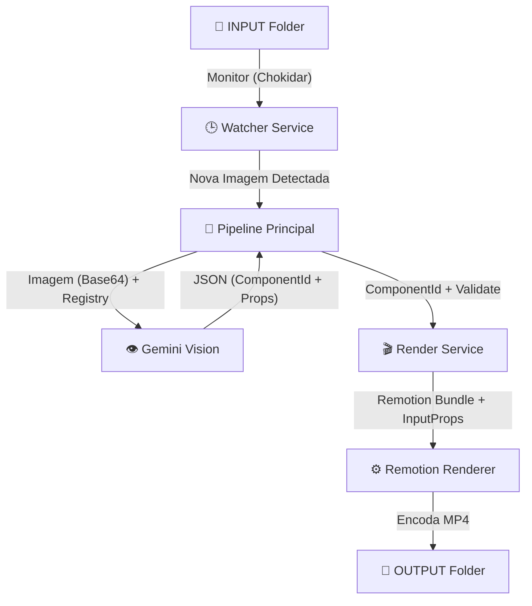

# GiantAnimator — Arquitetura de Pipeline (Fase B)

Este documento detalha o fluxo de automação que transforma imagens de gráficos em vídeos animados.

## 🏗️ Fluxo de Trabalho (Watch & Render)



1.  **Watcher Service (`server/watcherService.ts`)**: Observa a pasta de input. Ao detectar novo `.png`, `.jpg` ou `.webp`, aguarda a escrita estabilizar e chama o pipeline.
2.  **Pipeline (`server/pipeline.ts`)**: Coordenador central. Lê a imagem física, envia para a IA com o "Component Registry" anexado e valida a resposta.
3.  **Image Analysis (`server/prompts/imageAnalyzer.ts`)**: Prompt otimizado para o Gemini Vision extrair dados com alta fidelidade visual.
4.  **Render Service (`server/renderService.ts`)**: Encapsula a lógica de bundler e renderer do Remotion para gerar o arquivo `.mp4`.

---

## 🛠️ Como Adicionar Novos Componentes

Para o sistema reconhecer um novo tipo de gráfico:
1.  **Registre no `Root.tsx`** do projeto Remotion com um `Composition ID`.
2.  **Adicione ao `server/componentRegistry.ts`** seguindo o esquema `ComponentEntry`:
    - `id`: O ID exato usado no `Root.tsx`.
    - `aliases`: Palavras-chave para ajudar a IA.
    - `description`: Guia quando usar este gráfico.
    - `propsSchema`: Definição das propriedades que o componente aceita.
    - `exampleProps`: Um objeto de exemplo para orientar a extração de dados.

---

## ⚙️ Variáveis de Ambiente (.env)

O servidor requer:
- `GEMINI_API_KEY`: Para acesso à API Vision do Google.
- `PORT`: Porta do servidor (default: 3000).

---

## 🚀 Comandos

**Rodar o Servidor (Watch Mode):**
```bash
cd server
npm run dev
```

**Testar o Pipeline Unificado (Smoke Test):**
```bash
cd server
npx tsx smokeTest.ts
```

**Endpoint de Processamento Manual:**
`POST /process`
```json
{
  "filename": "meu_grafico.png"
}
```
*(O arquivo já deve estar na pasta INPUT)*
