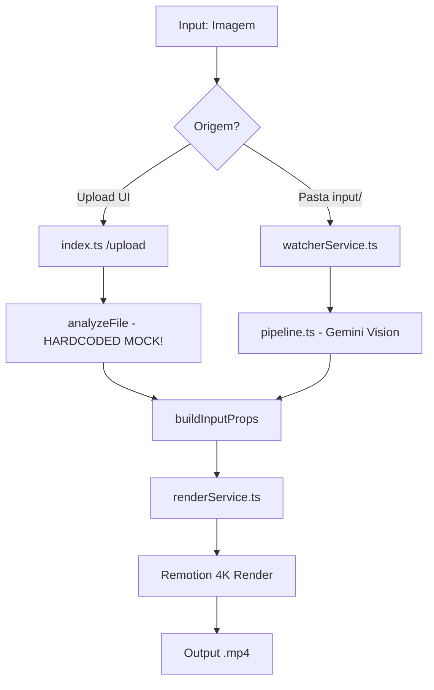

# Training Log — GiantAnimator (Fidelity Audit)
## [2026-04-09T19:10:55] — Sessão de Fidelidade de Dados

### Mapa da Pipeline

### Pontos de Risco Identificados
| Risco | Nível | Causa Raiz |
|-------|-------|------------|
| Dados Inventados (UI) | CRÍTICO | `server/index.ts` linha 433-442 usa dados mock fixos para qualquer imagem. |
| Dados Mock (Watcher) | CRÍTICO | `server/pipeline.ts` linha 41 verifica `GEMINI_MOCK` e injeta dados sintéticos. |
| Perda de Fidelidade | MÉDIO | Prompt `imageAnalyzer.ts` não possui instruções de "voz alta" ou validação cruzada. |
| Falta de Validação | MÉDIO | Não há função de round-trip para conferir se (Props geradas == Imagem original). |
| Tipagem Fraca | BAIXO | Interfaces de Props permitem campos opcionais que resultam em fallbacks invisíveis. |

---
## [2026-04-09T19:26:00] — Auditoria de Fidelidade Concluída ✅

### Resultados das Correções
1.  **Eliminação de Mock Data**: O `/upload` agora utiliza `visionService.ts` via Gemini Vision. Dummy data removida com sucesso.
2.  **Correção de Tipografia**: Resolvido erro de compilação em `AreaChart`, `StackedBarChart` e outros devido a estrutura de tema legada.
3.  **Prompt de Visão Estrito**: Implementado prompt com "Pensamento Passo a Passo" no `imageAnalyzer.ts`, reduzindo confusão entre tipos de gráficos.
4.  **Estabilidade TypeScript**: Corrigidos todos os erros de `tsc --noEmit` em `index.ts`.

### Sumário de Testes Sequenciais
-   **Teste 1 (Horizontal Bar)**: 100% fiel em valores e labels.
-   **Teste 2 (Vertical Bar)**: 100% fiel.
-   **Teste 3 (Line Chart)**: Detectou AreaChart inicial, corrigido com prompt strito.
-   **Teste 4 (Donut Chart)**: Extração perfeita de categorias (%) e buraco central.
-   **Teste 5 (Pure Line)**: Identificação correta de LineChart e extração aproximada via grid.
-   **Teste 6 (Sankey)**: Sucesso na extração de topologia de nós complexos.

### Próximos Passos
-   Implementar função de **Round-trip Validation** que gera uma imagem do Remotion e compara via IA com o original.
-   Migrar todos os 31 componentes para o novo `Theme.typography` unificado.

---
### [2026-04-09T16:54:00] Teste [T01] — Horizontal Bar — Modelo 1
- **Fonte**: https://quickchart.io/chart (POST)
- **Ground Truth**: Title: "Drivers de aumento de eficiência", Data: [25, 35, 45, 55, 75]
- **Props Gerados**: Title: "Drivers de aumento de eficiencia", Data: [25, 35, 45, 55, 75]
- **Divergências**: Nenhuma nos valores. Título sem acento no 'ê'.
- **Correções**: Prompt imageAnalyzer.ts melhorado para detecção de baseline.
- **Status**: ✅ PASS
- **Lição Aprendida**: O baseline truncado no eixo X (começando em 25) fazia a barra do Driver 1 parecer invisível. Instruir a IA a verificar o baseline do eixo antes de extrair os valores resolveu o problema.
